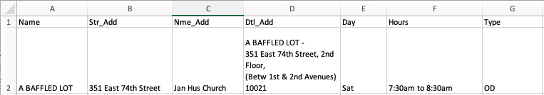

# Week 03

 

## Topics

Relational database, PostgreSQL, AWS RDS, SQL syntax, query RDB with pg


## Tasks

1. Set up a PostgreSQL database server on AWS.
2. Query AWS RDS with pg client on Node.js.
3. Create and populate tables in the database with pg queries.
4. Check database in an interactive way.

Planning to store tabular data (SQL):  
* A flat or denormalized data model might be better for small projects like this one, as it is cheaper and faster.
* When data comes back out of the database, it should be structured as JSON array with objects that have parallel features.
* The data hierarchy in our tabular format, would be flat, that each columns, or properties, be stored without nesting. 



## Key SQL syntax

```javascript
SELECT * FROM demo;
DROP TABLE demo;
CREATE TABLE demotable (address VARCHAR(100), lat DOUBLE PRECISION, lng DOUBLE PRECISION);
INSERT INTO demotable VALUES ("34 Fifth Ave, New York, NY", "40.12313", "-79,123123");
INSERT INTO demotable VALUES ("100 Crazy Ave, New York, NY", "40.11613", "-100,121123");
SELECT * FROM demotable;
--DROP TABLE demotable;
```

## Key Javascript solution

To create, delete and check a table in the database:
```javascript
// npm install pg
const { Client } = require('pg');

// AWS RDS POSTGRESQL INSTANCE
var db_credentials = new Object();
db_credentials.user = 'doerlbh';
db_credentials.host = 'data-structures.cuwjvah1c0p0.us-east-2.rds.amazonaws.com';
db_credentials.database = 'aa';
db_credentials.password = process.env.AWSRDS_PW;
db_credentials.port = 5432;

// Connect to the AWS RDS Postgres database
const client = new Client(db_credentials);
client.connect();

// SQL statement to create a table: 
var thisQuery = "CREATE TABLE aalocations (address varchar(100), lat double precision, long double precision);";

// SQL statement to delete a table: 
var thisQuery = "DROP TABLE aalocations;"; 

// SQL statement to query the entire contents of a table: 
var thisQuery = "SELECT * FROM aalocations;";

client.query(thisQuery, (err, res) => {
    console.log(err, res.rows);
    client.end();
});
```

To populate a table in the database:
```javascript
// SQL statement to populate a table: 
async.eachSeries(geostamps, function(value, callback) {
    const client = new Client(db_credentials);
    client.connect();
    var thisQuery = "INSERT INTO aalocations VALUES (E'" + value.address + "', " + value.latLong.lat + ", " + value.latLong.lng + ");";
    client.query(thisQuery, (err, res) => {
        console.log(err, res);
        client.end();
    });
    setTimeout(callback, 1000); 
}); 

```


## Documentation

* [SQL tutorial](https://www.linkedin.com/learning/sql-essential-training-2)  
* [PostgreSQL data types](https://www.postgresql.org/docs/9.4/static/datatype.html)  
* [PostgreSQL documentation](https://www.postgresql.org/docs/9.4/static/)
* [Node `pg` module](https://www.npmjs.com/package/pg)


