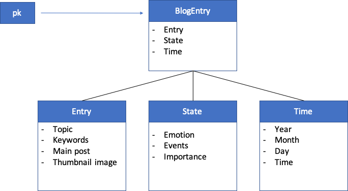

# Week 05

 

## Topics

NOSQL database, DynamoDB, AWS IAM, AWS SDK - putItem


## Tasks

1. Define a process blog class with NOSQL features.
2. Set up a DynamoDB database table on AWS.
3. Link Dynamo with (and grant permission to) AWS Cloud9/
4. Query AWS RDS with pg client on Node.js.
5. Create and populate tables in the database with aws-sdk putItem().
6. Check database in an interactive way at AWS.

Planning to store process blog (NOSQL):  
* A flat or denormalized data model might be better for the process if our blog doesn't involve too complicated hierarchy. 
* When data comes back out of the database, it should be structured as JSON array with objects that have parallel features. However, some relational structures might be helpful if we are dealing with recurring concepts.
* The data hierarchy would likely be defined at the first level by topics (e.g. "courses", "design", "life"), and then in each topic, we store blog post individually as parallel items. The date itself might involves some additional hierarchy.



## On defining a process blog class

```javascript
var blogEntries = [];

class BlogEntry {
  constructor(primaryKey, date, entry, happy, iate) {
    this.pk = {};
    this.pk.N = primaryKey.toString();
    this.date = {}; 
    this.date.S = new Date(date).toDateString();
    this.entry = {};
    this.entry.S = entry;
    this.happy = {};
    this.happy.BOOL = happy; 
    if (iate != null) {
      this.iate = {};
      this.iate.SS = iate; 
    }
    this.month = {};
    this.month.N = new Date(date).getMonth().toString();
  }
}

blogEntries.push(new BlogEntry(0, 'August 28 2019', "Yay, first day of class!", true, ["Cheez-Its", "M&Ms"]));
blogEntries.push(new BlogEntry(1, 'October 31, 2015', "I piloted my first solo flight!", true, ["pancakes"]));
blogEntries.push(new BlogEntry(2, 8675309, "867-5309?", false));
blogEntries.push(new BlogEntry(3, 'September 25, 2019', "I taught my favorite students.", true, ["peas", "carrots"]));

console.log(blogEntries);
```

## On populating DynamoDB database table

```javascript
var AWS = require('aws-sdk');
AWS.config = new AWS.Config();
AWS.config.region = "us-east-2";

var dynamodb = new AWS.DynamoDB();

// Populate process blog items

async.eachSeries(blogEntries, function(value, callback) {
  var params = {};
  params.Item = value; 
  params.TableName = "processblog";
  dynamodb.putItem(params, function (err, data) {
    if (err) console.log(err, err.stack); // an error occurred
    else     console.log(data);           // successful response
    });  
  setTimeout(callback, 1000); 
});
```


