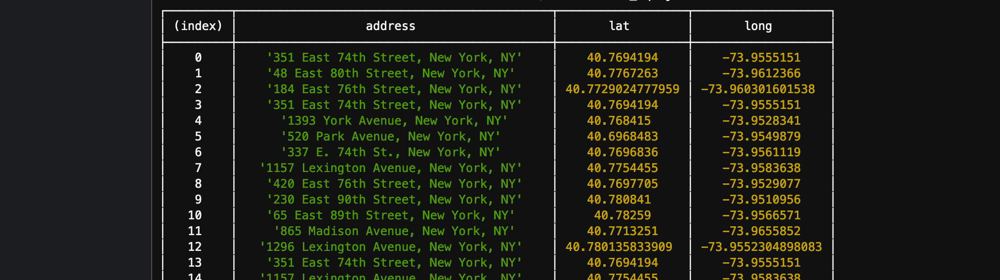

# Week 06

 

## Topics

Query (with filters and conditions) to SQL (PostgreSQL) and NOSQL (DynamoDB) databases


## Tasks

1. Query PostgreSQL given conditions.

2. Query DynamoDB given conditions.

3. Change formats of journal blog and meeting data for future tasks.

   

## Query PostgreSQL 

```javascript
// npm install pg

const { Client } = require('pg');
const dotenv = require('dotenv');
dotenv.config({path: '../.env'});


// AWS RDS POSTGRESQL INSTANCE
var db_credentials = new Object();
db_credentials.user = 'doerlbh';
db_credentials.host = 'data-structures.cuwjvah1c0p0.us-east-2.rds.amazonaws.com';
db_credentials.database = 'aa';
db_credentials.password = process.env.AWSRDS_PW;
db_credentials.port = 5432;


// Connect to the AWS RDS Postgres database
const client = new Client(db_credentials);
client.connect();

// Sample SQL statement to query location in certain region: 
var thisQuery = "SELECT * FROM aalocations WHERE  lat > 40.77 and long <= -73.96;;";

client.query(thisQuery, (err, res) => {
    if (err) {throw err}
    else {
        console.table(res.rows);
        client.end();
    }
});
```

The query input:

The query output:


## Query DynamoDB 

```javascript
// npm install aws-sdk
var AWS = require('aws-sdk');
AWS.config = new AWS.Config();
AWS.config.region = "us-east-2";

var dynamodb = new AWS.DynamoDB();

var params = {
    TableName : "bhprocessblog",
    KeyConditionExpression: "#tp = :topicName and #dt between :minDate and :maxDate", // the query expression
    ExpressionAttributeNames: { // name substitution, used for reserved words in DynamoDB
        "#tp" : "tp",
        "#dt" : "dt"
        // "#st" : "state"
    },
    ExpressionAttributeValues: { // the query values
        ":topicName": {S: "cats"},
        ":minDate": {N: new Date("August 1, 2017").valueOf().toString()},
        ":maxDate": {N: new Date("December 11, 2020").valueOf().toString()}
        // ":stateName": {S: "happy"}
    }
};

dynamodb.query(params, function(err, data) {
    if (err) {
        console.error("Unable to query. Error:", JSON.stringify(err, null, 2));
    } else {
        console.log("Query succeeded.");
        data.Items.forEach(function(item) {
            console.log("***** ***** ***** ***** ***** \n", item);
        });
    }
});
```

The query input:


The query output:


## Documentation

* [Overview to SQL Query](https://beginner-sql-tutorial.com/sql-select-statement.htm)  
* [SQL Query](https://www.postgresql.org/docs/9.4/queries.html)  (PostgreSQL)
* [NOSQL Query](https://docs.aws.amazon.com/amazondynamodb/latest/APIReference/API_Query.html) (DynamoDB)

