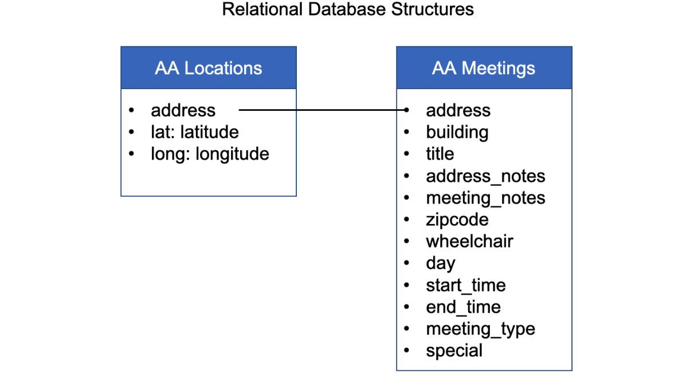

# Week 07

 

## Topics

Javascript, jQuery, cheerio, SQL


## Tasks

1. Clean up all the HTML files in the AA dataset
2. Extract important meeting-related information
3. Push them onto PostgreSQL databases
  
  
## Relational Database Structure for the dataset

The RDS structure is updated to be the following:



Organize preprocessed data:

* **folder ../data/address/**: extracted JSON that stored address information
* **folder ../data/geostamp/**: extracted JSON that stored address geostamps
* **folder ../data/meeting/**: extracted JSON that stored meeting information
* **folder ../data/html/**: original crawled HTML files

  
  
## Crawl HTML data with jQuery and cheerio.js

File: crawlData.js

```javascript
// dependencies
const fs = require('fs'),
    querystring = require('querystring'),
    request = require('request'),
    async = require('async'),
        dotenv = require('dotenv');

var cheerio = require('cheerio');

for (let i = 1; i < 11; i++) {

    let filecount = ('0' + i).slice(-2);

    var content = fs.readFileSync('../data/html/m' + filecount + '.txt');
    var $ = cheerio.load(content);

    var addresses = $('h4').slice(2) // extract address name 
        .map((i, elem) => $(elem.parentNode).text()
            .split("\n")[3].trim()
            .split(',')[0].trim()
            .split('-')[0].trim())
        .get();

    fs.writeFileSync('../data/address/m' + filecount + '_addresses.json', JSON.stringify(addresses));

    var meetinginfo = $('td[style="border-bottom:1px solid #e3e3e3;width:350px;"]') // extract full meeting info
        .map((i, elem) => $(elem).text()
            .split("\n")
            .map(x => x.trim())
            .filter(x => x.length > 0)
            .join('\n'))
        .get();

    var addressinfo = $('h4').slice(2) // extract full address info     
        .map((i, elem) => $(elem.parentNode).html()
            .split("\n")
            .map(x => x.trim())
            .filter(x => x.length > 0)
            .join('\n')
            .replace('<br>', ''))
        .get();

    var meetings = [];
    meetinginfo.forEach((meetingset, i) => {
        var submeetings = meetingset.split('\n').map((mtext) => {
            var meeting = {};
            meeting.address = addresses[i] + ", New York, NY";
            meeting.building = addressinfo[i].split('</h4>')[0].split('>')[1].replace('<br>', '').trim();
            meeting.title = (addressinfo[i].split('\n')[1].startsWith('<b>') ? addressinfo[i].split('\n')[1].split('</b>')[0].split('<b>')[1].split('-')[0].trim() : '');
            meeting.address_notes = addressinfo[i].split('\n').slice(2, 4).join('').replace(',', ', ').replace('  ', ' ').replace('<br>', '').trim();
            meeting.meeting_notes = (addressinfo[i].includes('detailsBox') ? addressinfo[i].split('"detailsBox">')[1].split('</div')[0].replace('\n', '').replace('<br>', '').trim() : '');
            meeting.zipcode = meeting.address_notes.slice(meeting.address_notes.length - 5);
            meeting.wheelchair = (addressinfo[i].includes('wheelchair') ? true : false);
            meeting.day = mtext.split(' ')[0].trim();
            meeting.start_time = mtext.split('From')[1].split('to')[0].trim();
            meeting.end_time = mtext.split('to')[1].trim().split(' ').slice(0, 2).join(' ').trim();
            meeting.meeting_type = (mtext.includes('Type') ? mtext.split('Type')[1].trim().split('Special')[0].trim() : '');
            meeting.special = (mtext.includes('Special Interest') ? mtext.split('Special Interest')[1].trim() : '');
            return meeting; 
        });

        submeetings.forEach((meeting) => {
            meetings.push(meeting);
        });
    });

    fs.writeFileSync('../data/meeting/m' + filecount + '_meetings.json', JSON.stringify(meetings));

}
```

Example of the JSON output of meeting information:

```javascript
  {
    "address": "184 East 76th Street, New York, NY",
    "building": "St. Jean Baptiste Church",
    "title": "ACTIVE",
    "address_notes": "184 East 76th Street, Basement,(Betw Lexington &amp; 3rd Avenues - Ring Bell) NY 10021",
    "meeting_notes": "",
    "zipcode": "10021",
    "wheelchair": true,
    "day": "Wednesdays",
    "start_time": "6:00 PM",
    "end_time": "7:00 PM",
    "meeting_type": "S = Step meeting",
    "special": ""
  },
  {
    "address": "351 East 74th Street, New York, NY",
    "building": "Jan Hus Church",
    "title": "AFTERNOON AWAKENING",
    "address_notes": "351 East 74th Street, 2nd Floor,(Betw. 1st &amp; 2nd Avenues) 10021",
    "meeting_notes": "Mon=Living Sober, Thu=11 Step with meditation, Fri=3rd Step",
    "zipcode": "10021",
    "wheelchair": false,
    "day": "Mondays",
    "start_time": "2:30 PM",
    "end_time": "3:30 PM",
    "meeting_type": "B = Beginners meeting",
    "special": "Living Sober"
  }
```


## Crawl geostamps from TAMU API

File: crawlGeo.js

```javascript
// dependencies
const fs = require('fs'),
    querystring = require('querystring'),
    request = require('request'),
    async = require('async'),
        dotenv = require('dotenv');

var cheerio = require('cheerio');

for (let i = 1; i < 11; i++) {

    let filecount = ('0' + i).slice(-2);

    var content = fs.readFileSync('../data/html/m' + filecount + '.txt');
    var $ = cheerio.load(content);

    var addresses = $('h4').slice(2) // extract address name 
        .map((i, elem) => $(elem.parentNode).text()
            .split("\n")[3].trim()
            .split(',')[0].trim()
            .split('-')[0].trim())
        .get();

    // TAMU api key
    dotenv.config({
        path: '../.env'
    });
    const API_KEY = process.env.TAMU_KEY;
    const API_URL = 'https://geoservices.tamu.edu/Services/Geocode/WebService/GeocoderWebServiceHttpNonParsed_V04_01.aspx'

    // geocode addresses
    let meetingsData = [];

    // eachSeries in the async module iterates over an array and operates on each item in the array in series
    async.eachSeries(addresses, function(value, callback) {
        let query = {
            streetAddress: value,
            city: "New York",
            state: "NY",
            apikey: API_KEY,
            format: "json",
            version: "4.01"
        };

        // construct a querystring from the `query` object's values and append it to the api URL
        let apiRequest = API_URL + '?' + querystring.stringify(query);

        request(apiRequest, function(err, resp, body) {
            if (err) {
                throw err;
            }

            let tamuGeo = JSON.parse(body);
            // console.log(tamuGeo['FeatureMatchingResultType'], apiRequest);
            console.log(tamuGeo['FeatureMatchingResultType'], value);
            var tamuGeoItem = {
                address: value + ", New York, NY",
                latLong: {
                    lat: tamuGeo.OutputGeocodes[0].OutputGeocode.Latitude,
                    lng: tamuGeo.OutputGeocodes[0].OutputGeocode.Longitude
                }
            };
            meetingsData.push(tamuGeoItem);
        });

        // sleep for a couple seconds before making the next request
        setTimeout(callback, 1000);
    }, function() {
        fs.writeFileSync('../data/geostamp/m' + filecount + '_geostamps.json', JSON.stringify(meetingsData));
        console.log('*** *** *** *** ***');
        console.log(`Number of meetings in this zone: ${meetingsData.length}`);
    });

}

```

   

## Create and update postgreSQL tables 

File: addToPostgre.js

```javascript
// npm install pg
const {
    Client
} = require('pg');
const dotenv = require('dotenv');
const fs = require('fs');
var async = require('async');

dotenv.config({
    path: '../.env'
});

// AWS RDS POSTGRESQL INSTANCE
var db_credentials = new Object();
db_credentials.user = 'doerlbh';
db_credentials.host = 'data-structures.cuwjvah1c0p0.us-east-2.rds.amazonaws.com';
db_credentials.database = 'aa';
db_credentials.password = process.env.AWSRDS_PW;
db_credentials.port = 5432;

// Connect to the AWS RDS Postgres database
const client = new Client(db_credentials);
client.connect();

// NOTE: Run the following queries one at a time!

var thisQuery = "DROP TABLE aalocations;";

client.query(thisQuery, (err, res) => {
    console.log(err, res);
    client.end();
});
 
var thisQuery = "DROP TABLE aameetings;";

client.query(thisQuery, (err, res) => {
    console.log(err, res);
    client.end();
});

var thisQuery = "CREATE TABLE aalocations (address varchar(100), lat double precision, long double precision);";

client.query(thisQuery, (err, res) => {
    console.log(err, res);
    client.end();
});

var thisQuery = " CREATE TABLE aameetings (address varchar(100), building varchar(100), title varchar(50), address_notes varchar(250), meeting_notes varchar(250), zipcode varchar(10), wheelchair varchar(10), day varchar(20), start_time varchar(10), end_time varchar(10), meeting_type varchar(50), special varchar(50));";

client.query(thisQuery, (err, res) => {
    console.log(err, res);
    client.end();
});

for (let i = 1; i < 11; i++) {

    // var i = 10;

    let filecount = ('0' + i).slice(-2);

    var aadata = JSON.parse(fs.readFileSync('../data/meeting/m' + filecount + '_meetings.json'));
    var geostamps = JSON.parse(fs.readFileSync('../data/geostamp/m' + filecount + '_geostamps.json'));

    // AWS RDS POSTGRESQL INSTANCE
    var db_credentials = new Object();
    db_credentials.user = 'doerlbh';
    db_credentials.host = 'data-structures.cuwjvah1c0p0.us-east-2.rds.amazonaws.com';
    db_credentials.database = 'aa';
    db_credentials.password = process.env.AWSRDS_PW;
    db_credentials.port = 5432;

    async.eachSeries(aadata, function(value, callback) {
        const client = new Client(db_credentials);
        client.connect();
        var thisQuery = "INSERT INTO aameetings VALUES (E'" + value.address + "', E'" + value.building + "', E'" + value.title + "', E'" + value.address_notes + "', E'" + value.meeting_notes + "', E'" + value.zipcode + "', E'" + value.wheelchair + "', E'" + value.day + "', E'" + value.start_time + "', E'" + value.end_time + "', E'" + value.meeting_type + "', E'" + value.special + "');";
        client.query(thisQuery, (err, res) => {
            console.log(err, res);
            client.end();
        });
        setTimeout(callback, 500);
    });

    async.eachSeries(geostamps, function(value, callback) {
        const client = new Client(db_credentials);
        client.connect();
        var thisQuery = "INSERT INTO aalocations VALUES (E'" + value.address + "', " + value.latLong.lat + ", " + value.latLong.lng + ");";
        client.query(thisQuery, (err, res) => {
            console.log(err, res);
            client.end();
        });
        setTimeout(callback, 500);
    });
    
}

```

   

## Check postgreSQL for aameetings table

File: checkPostgre.js

```javascript
// npm install pg

const { Client } = require('pg');
const dotenv = require('dotenv');
dotenv.config({path: '../.env'});


// AWS RDS POSTGRESQL INSTANCE
var db_credentials = new Object();
db_credentials.user = 'doerlbh';
db_credentials.host = 'data-structures.cuwjvah1c0p0.us-east-2.rds.amazonaws.com';
db_credentials.database = 'aa';
db_credentials.password = process.env.AWSRDS_PW;
db_credentials.port = 5432;


// Connect to the AWS RDS Postgres database
const client = new Client(db_credentials);
client.connect();

// Sample SQL statement to query the entire contents of a table: 
// var thisQuery = "SELECT * FROM aalocations;";
var thisQuery = "SELECT * FROM aameetings;";

client.query(thisQuery, (err, res) => {
    console.log(err, res.rows);
    client.end();
});

```

Example query output:


```javascript
  { address: '273 Bowery, New York, NY',
    building: 'University Settlement (The Chinatown YMCA)',
    title: 'EAST VILLAGE SOBER AGNOSTICS',
    address_notes: '273 Bowery, (@ Houston Street) NY 10002',
    meeting_notes: 'Ask front desk for meeting location',
    zipcode: '10002',
    wheelchair: 'true',
    day: 'Fridays',
    start_time: '6:45 PM',
    end_time: '8:00 PM',
    meeting_type: 'OD = Open Discussion meeting',
    special: 'Agnostic' },
  { address: '220 West Houston Street, New York, NY',
    building: '',
    title: 'MIDNITE',
    address_notes:
     '220 West Houston Street, 2nd Floor,(Betw 6th Avenue &amp; Varick Street) 10014',
    meeting_notes:
     'Sun.12:30=Meditation, 2am Meetings=Pitch meeting with candlelight. Mon.8pm=Topic, Tues.10pm=T last Tues., Thu.10pm=Problems in Sobriety <br>Sun.8pm=Bus.Meeting last Sun.,Sat.10pm=Anniv.Last',
    zipcode: '10014',
    wheelchair: 'false',
    day: 'Sundays',
    start_time: '5:15 PM',
    end_time: '6:15 PM',
    meeting_type: 'S = Step meeting',
    special: '' },
```
